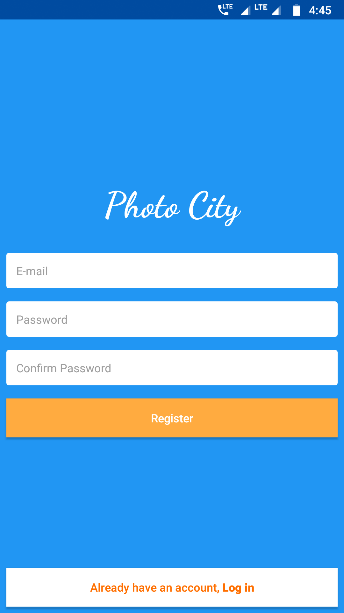
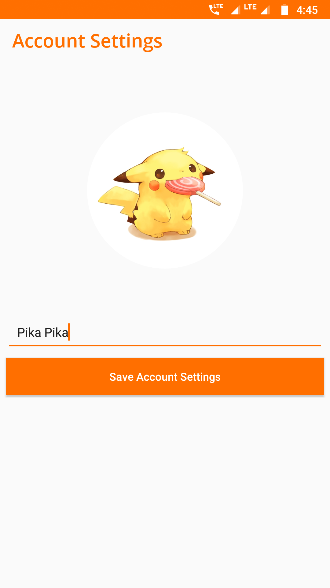

# PhotoCity

A Project designed to understand the basic features of Firebase. It implements Firebase Authentication, Storage, and Database Management.

         
       

### APK File
You can download the app <a href="app/apk/debug/app-debug.apk">here</a>.
